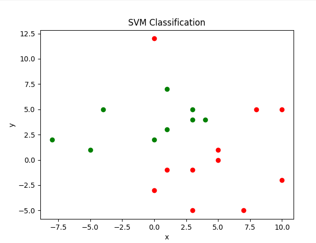

# SVM-Linear-Classifier

## Description
The goal of this program is to implement a Support Vector Machine (SVM) linear classifier from scratch using Gradient Descent optimization. Created to bridge the gap between theoretical machine learning mathematics and low-level software engineering, this project eliminates the reliance on "black-box" frameworks (like scikit-learn). It provides a high-performance C++ backend to train the model on 2D spatial data (generated via Poisson distribution, read from files, or inputted manually) and calculates the optimal separating hyperplane, while a Python pipeline visualizes the classification decision boundary.

### Technologies Used
* **C++** — core algorithmic engine utilized for file I/O operations, random spatial data generation, and executing the gradient descent mathematical optimization.
* **Python** — secondary language used exclusively for the data presentation pipeline.
* **Matplotlib** — applied in Python for rendering 2D scatter plots to visualize the distinct data classes and the calculated SVM decision boundary.

### Results
The C++ backend successfully processes the labeled coordinate data and iteratively adjusts the algorithmic weights and bias using a defined learning rate and regularization parameter (lambda). It accurately computes the linear separator for linearly separable datasets and gracefully handles and identifies non-separable data structures (as logged in `result.txt`). The output confirms the mathematical stability of the custom gradient descent implementation.

### Visualization
The Python script interprets the outputted weights and points, automatically generating a 2D plot that clearly distinguishes the two classes (red and green) and overlays the computed SVM decision boundary (blue line).

<p align="center">
  <b>SVM Decision Boundary Visualization</b><br><br>
  <br><br>
  <sub>Red vs Green class separation via computed hyperplane</sub>
</p>

## Quick Start Guide

### 1. Download the Files
Save the C++ source file `SVM-Linear-Classifier.cpp`, the datasets (`points.txt`, `points1.txt`), and the Python visualization script `Visualisation.py` to your local machine.

### 2. Install Python Dependencies
Ensure you have Python 3.8+ installed. Open your terminal and install the plotting library:
```bash
pip install matplotlib
```
### 3. Compile and Run the C++ Model
Ensure you have a C++ compiler (g++) installed. Navigate to the folder containing your files and execute:
```bash
g++ SVM-Linear-Classifier.cpp -o SVM-Linear-Classifier
SVM-Linear-Classifier.exe
```
### 4. Render the Visualization
Once the C++ program finishes writing the coordinates and weights to the text files, run the Python script to display the classification results:
```bash
python Visualisation.py
```
